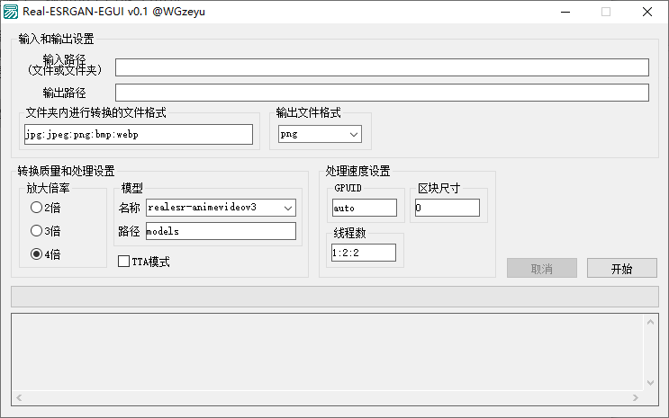
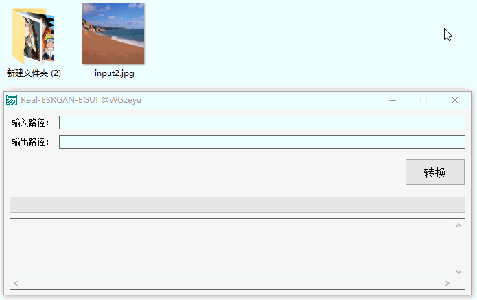

# Real-ESRGAN-EGUI
类似[waifu2x-caffe](https://github.com/lltcggie/waifu2x-caffe)的[Real-ESRGAN](https://github.com/xinntao/Real-ESRGAN)图形界面。  
Waifu2x用习惯了，所以做了个相似的GUI自用。   
这是一个非常简单的为了自用而制作的工具，原理仅仅只是把GUI界面操作生成为CLI命令行调用。   
### 下载：[软件界面](https://github.com/WGzeyu/Real-ESRGAN-EGUI/releases/latest) | [转换核心](https://github.com/xinntao/Real-ESRGAN/releases/tag/v0.2.5.0)
你需要同时下载界面与核心，解压核心包后，将界面程序放进去才能运行。  
（将`Real-ESRGAN-EGUI.exe`放入到`realesrgan-ncnn-vulkan.exe`所在文件夹内即可运行）
　　  

## 支持功能
- 单选拖入、多选拖入
- 添加文件、文件夹
- 参数调整
- 保存设置
- 一键转换
- 中途取消(多文件)
- 进度条(多文件)
- 界面类似Waifu2x

gif懒得更新了，这个是早期版本  

### 关于本项目
如果基于本软件修改/发布，需要同样以GPL协议开源，不能删除我的ID  
本项目引用了以下模块（均为开源模块）：  
* 精易模块 源码：[http://ec.125.la/](http://ec.125.la/)
* zyJson 源码：[谷歌搜索](https://www.google.com/search?q=%E6%98%93%E8%AF%AD%E8%A8%80+zyjson&nfpr=1) [百度搜索](https://www.baidu.com/s?wd=%E6%98%93%E8%AF%AD%E8%A8%80%20zyjson)
